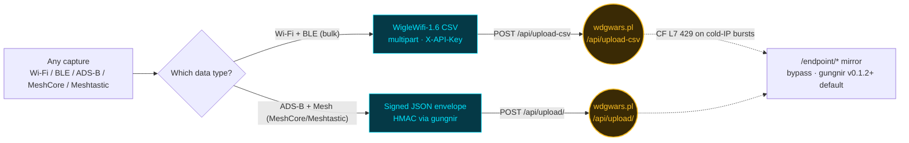
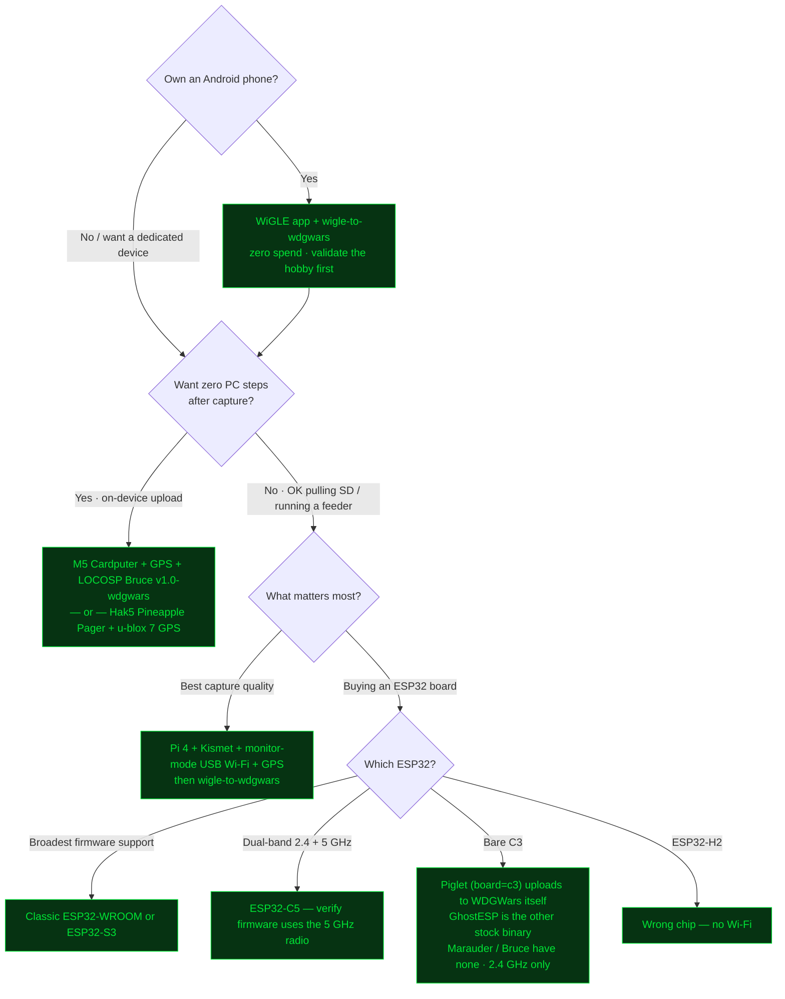

# Wardriving hardware + firmware survey for WDGWars

> Citation policy: every concrete claim about a firmware/repo/chip has an inline link to a primary source pulled live on 2026-06-02 (release versions, dates, and star counts re-pulled 2026-07-20). Prices are intentionally absent — see §6 for the reasoning. A handful of cells are labeled "field-tested but not citable from public docs" — those are working knowledge from running the feeders, flagged so a future maintainer can re-verify if they doubt the claim.

> **2026-07-25 pass:** §3e (the wider firmware catalog, covering everything that wardrives without a WDGWars uploader) and §10 (maturity signals for the long-running repos) are new. §4 gained a caveat because Ghost_ESP is now archived, §A gained the WDGWars rebrand note, and Biscuit's app-mediated upload path is detailed in §3. Star counts and last-push dates in the new sections came from `gh api repos/<owner>/<repo>` on 2026-07-25.

> **Looking for the newcomer onramp?** See [[wdgwars-newcomer-progression]] for the leveled walkthrough from "just got an Android phone" → "lab-scale capture." The companion canvas at [[wdgwars-capture-flow]] visualizes the same paths as a flow diagram.

## 1. How a capture reaches wdgwars.pl

Two server-side upload paths exist. Picking firmware mostly reduces to which path it can use.

| Path | Endpoint | Auth | Format | Notes |
|---|---|---|---|---|
| Bulk WiFi/BLE CSV | `POST /api/upload-csv` | `X-API-Key` header, multipart | WigleWifi-1.6 CSV | Used by Bruce-WDGWars fork on-device and by the Pineapple Pager payload — confirmed in primary source READMEs cited below. |
| Signed JSON envelope | `POST /api/upload/` | HMAC via `gungnir` | JSON, slot-typed (`aircraft`, `meshcore_nodes`, …) | Used by HiroAlleyCat feeders (Muninn, Heimdall, wigle-to-wdgwars). The `meshcore_nodes` slot takes both MeshCore and Meshtastic records, told apart by a `network` field (see §1a). |

A `/endpoint/*` mirror exists for clients that want to dodge Cloudflare's L7 rate limit on `/api/*` (returns 429 + code 1027 on cold-IP bursts). The shared transport handles this at the library layer — `gungnir` tag [v0.1.2](https://github.com/Yggdrasil-AI-labs/gungnir/releases/tag/v0.1.2) flipped the default base URL; pin >= v0.1.2 to inherit. Hand-rolled HTTP clients (Bruce on-device, anything you write yourself) need the URL flip too if they want the bypass.

### 1a. MeshCore vs Meshtastic: the mesh slot contract

**MeshCore and Meshtastic are not the same thing**, and mixing them up is common enough to be worth spelling out. Both are LoRa firmware for sub-GHz radios, and they often run on identical hardware: a T-Beam, a Heltec, a Wio Tracker can boot into either one. What differs is the firmware and the on-air protocol. A MeshCore node and a Meshtastic node on the same frequency do not talk to each other; picking one means re-flashing if you later want the other.

As of **2026-08-12, per LOCOSP**, the WDGWars mesh slot (`meshcore_nodes`) accepts both networks, told apart rather than mixed:

- Records carry a `network` field, `meshcore` or `meshtastic`. If present, it's authoritative.
- Omit it and the server infers from the role name: MeshCore roles are Title Case, Meshtastic roles are SCREAMING_SNAKE, and the two sets don't overlap. Any other `network` value is rejected outright with its own reason, `bad_network`. Before today an unrecognized role was silently filed as MeshCore, which is how Meshtastic data had been arriving without anyone deciding it should.
- Node ids may carry a leading `!` or not; the server strips it.
- Send the role exactly as captured. It's stored verbatim and mapped onto the server's own internal set feeder-side, no translation needed (`ROUTER`, `CLIENT_MUTE`, `SENSOR`, etc. all land sensibly).
- **Ids no longer collide across networks.** A MeshCore id is a key prefix; a Meshtastic id is a device number. The same string can legitimately be two different devices, and is now stored as two separate nodes.
- **Prefix merging stays MeshCore-only.** Resolving a short on-air id against a longer key seen elsewhere in the same capture means nothing in Meshtastic and isn't applied there.
- **Hops never reject a sighting.** A sighting counts however it arrived. Send `path_hops` if the capture has it; omit it and the server assumes direct. A sighting can only move a node's stored position if it's at least as close as whatever set the current position, so a direct sighting always wins and a hopped one only fills in a position not already known. The practical guidance: send everything you captured, hopped or not, and tell the server the hop count if you have it.

For MeshCore specifically, the canonical `node_id` is the first 8 bytes of the node's Ed25519 public key, lowercase hex, 16 characters; the server's gate is `[a-f0-9]{8,16}`. The short 2-6 hex ids you see on-air are a local disambiguator, not an identity. Feeders may optionally send the full `public_key` (64 hex), with `node_id` verified as its prefix.

Today, [Heimdall](https://github.com/Yggdrasil-AI-labs/meshcore-to-wdgwars) only parses MeshCore exports (MeshMapper CSV). A Meshtastic-native feeder is still unbuilt, tracked in §9. Buying Meshtastic gear no longer means the slot won't take your data once something parses it into the envelope; it means the parser doesn't exist yet.

## 2. Firmwares that upload to WDGWars directly (on-device, no PC needed)

Five projects verified to upload to WDGWars from the capture device itself (the first four as of 2026-06-02; ESP32 Dual Band Wardriver added 2026-07-20).

> **A sixth path needs no PC either, but uploads from your phone rather than the board.** Biscuit (Pro, Ultra, and the free DIY firmware) pairs to an iOS or Android app that supplies GPS and performs the upload, so the board itself never touches Wi-Fi credentials or a GPS module. Field-verified working across all three variants on 2026-07-25. Hardware detail and citations are in the Biscuit row of §3; it stays there rather than moving here because its firmware is closed source, so unlike the five rows below you cannot read the upload path yourself.

| Firmware | Hardware | Upload path | Source citation |
|---|---|---|---|
| **LOCOSP Bruce fork** ([repo](https://github.com/LOCOSP/bruce-firmware-wdgwars), tag [`v1.0-wdgwars`](https://github.com/LOCOSP/bruce-firmware-wdgwars/releases/tag/v1.0-wdgwars) released 2026-04-09) | M5 family + everything upstream Bruce supports — see §4 | `POST /api/upload-csv`, WigleWifi-1.6 | Tree at the tag contains [`src/modules/gps/wdgwars.cpp`](https://github.com/LOCOSP/bruce-firmware-wdgwars/blob/v1.0-wdgwars/src/modules/gps/wdgwars.cpp) (verified via `gh api .../git/trees/v1.0-wdgwars?recursive=1`). |
| **Piglet** ([hamspiced/piglet](https://github.com/hamspiced/piglet), 213 stars, last push 2026-07-23 as of the 2026-08-11 check) | XIAO ESP32-C5, S3, C6, and C3; separate T-Dongle C5 variant. C++ Arduino-based firmware. Designed for XIAO + external GPS. | `POST /api/upload-csv` for bulk + `GET /api/me` for key validation. X-API-Key header. Controlled via browser web UI — "Test Key" / "Upload All" buttons. | Verified live via code search: [`Arduino Files/Piglet/WigleUpload.h`](https://github.com/hamspiced/piglet/blob/main/Arduino%20Files/Piglet/WigleUpload.h) declares `wdgwarsTestKey()`, `uploadFileToWdgwars()`, `uploadAllCsvsToWdgwars()`. UI element labeled `<label>WDGoWars API Key</label>` with link to `wdgwars.pl/profile`. Adds C5/S3/C6 plus a 2.4 GHz-only C3 target to the on-device-uploader chip support set. |
| **LOCOSP Pineapple Pager WDGWars** ([repo](https://github.com/LOCOSP/pineapple_pager_wdgwars)) | Hak5 WiFi Pineapple Pager + u-blox 7 USB GPS stick | `POST /api/upload-csv`, WigleWifi-1.6 | README quotes verbatim: *"Stores everything as standard WigleWifi-1.6 CSV"* and *"Manual SYNC NOW uploads pending CSVs to POST /api/upload-csv"*. GPS is mandatory: *"3D fix required before scan starts."* |
| **Raspyjack WDGWars payload** ([repo](https://github.com/7h30th3r0n3/Raspyjack), payload at [`payloads/exfiltration/wdgwars_upload.py`](https://github.com/7h30th3r0n3/Raspyjack/blob/main/payloads/exfiltration/wdgwars_upload.py)) | Raspberry Pi + LCD 1.44" + GPIO buttons (same Raspyjack base unit) | `POST /api/upload-csv` for CSV + `/api/upload` for JSON + `/api/me` for profile checks, X-API-Key header, multipart Wigle CSV | Payload script reads from `/root/Raspyjack/loot/wardriving/sessions/`. Raspyjack repo description doesn't mention WDGWars — the upload path lives only in this payload file. |
| **ESP32 Dual Band Wardriver** ([justcallmekoko/ESP32DualBandWardriver](https://github.com/justcallmekoko/ESP32DualBandWardriver), 184 stars, v2.3.0 released 2026-07-09) | ESP32-C5-DevKitC-1 v1.2 — dual-band 2.4 + 5 GHz WiFi + BLE. GPS required for Solo/Core modes; Node mode runs without GPS. | Direct upload to WDGWars from the web UI via a stored WDGWars API key; also writes WiGLE-format CSV to SD. Exact endpoint not documented in the public README — verify the route before depending on it. | By the ESP32 Marauder author. Web-UI config lists *"WDG Wars API key — for direct log upload to WDGWars"* alongside the WiGLE path. This is the dedicated firmware that actually uses the C5's 5 GHz radio (see §4). |

> Piglet was wrongly listed as "not found" in §A of v3 — that was a search-term issue (looked for `wdgwars piglet` instead of `hamspiced piglet`). Reinstated to §2 as the third confirmed on-device uploader after a Marauder-ecosystem deep-dive surfaced [`hamspiced/piglet`](https://github.com/hamspiced/piglet). Raspyjack was similarly reinstated in v4 after the README-only dismissal turned out to miss the payload script.

> **In development — HellzGate C5.** [Hellz0wnzJ00/hellzgate](https://github.com/Hellz0wnzJ00/hellzgate) is an ESP32-C5 multi-node passive survey array — one master coordinating up to nine scanner nodes over an I²C backplane, dual-band 2.4/5 GHz Wi-Fi + BLE, onboard GPS, microSD, OLED, USB-C — by Hellz (Sean Clossey), a WDGWars Discord mod. Per its README, WiGLE / WDGWars upload is **firmware Phase 3 — planned, not yet shipped**, and the firmware is proprietary/closed-source (the repo is product info + links only, no releases yet). Listed here so the family is visible; it graduates to the verified table above once on-device upload ships. Site: [hellzgate.com](https://hellzgate.com).

## 3. Capture firmwares that need a PC-side feeder

These firmwares produce useful capture data but don't upload to WDGWars directly. Convert via [wigle-to-wdgwars](https://github.com/Yggdrasil-AI-labs/wigle-to-wdgwars) (for WiGLE-compatible CSV) or the slot-typed feeders.

| Firmware | Hardware fit (current release) | Output | Feeder needed |
|---|---|---|---|
| **ESP32 Marauder v1.13.0** ([release](https://github.com/justcallmekoko/ESP32Marauder/releases/tag/v1.13.0), repo 11.6k+ stars, nightlies near-daily) | See §4 chip matrix | WigleWifi-1.4 (11 cols, missing Frequency/RCOIs/MfgrId) to SD — verified at [`WiFiScan.h:682`](https://github.com/justcallmekoko/ESP32Marauder/blob/master/esp32_marauder/WiFiScan.h#L682) hard-coding `WigleWifi-1.4` + 11-field header. wardrive_line construction at WiFi `:4508` and BLE `:547`/`:1132`/`:4646`/`:7346` emits those 11 fields. | wigle-to-wdgwars after SD pull (pads to 1.6). **Marauder requires a GPS module attached** — without it the wardrive dumps are empty. Verified at [`WiFiScan.cpp:515-551`](https://github.com/justcallmekoko/ESP32Marauder/blob/master/esp32_marauder/WiFiScan.cpp#L515) gating `wardrive_line` behind `getGpsModuleStatus()` AND `getFixStatus()`. GPS modification community is well-documented — [official wiki](https://github.com/justcallmekoko/ESP32Marauder/wiki/gps-modification) lists Teyleten Robot ATGM336H NEO-6M + DWEII GY-NEO6MV2 with pin tables. |
| **Bruce upstream 1.16** ([release](https://github.com/BruceDevices/firmware/releases/tag/1.16), 2026-07-24) | See §4 chip matrix | WigleWifi CSV to SD | Upstream Bruce does NOT have the WDGWars upload path — only the LOCOSP fork does. SD pull → wigle-to-wdgwars, OR flash the LOCOSP fork. |
| **GhostESP VA1.4.8** ([release](https://github.com/Spooks4576/Ghost_ESP/releases/tag/VA1.4.8), released 2025-03-31 — no release in 15+ months as of 2026-07-20) | See §4 chip matrix | Varies by command; output shape lacks BSSID on some commands on bare C3 in headless USB-CDC. Verify the output of `list -a` or `capture -beacon` on your specific chip before depending on it. | Wigle-format conversion is uncertain — verify per command before depending on it. |
| **Evil-M5Project** ([README](https://github.com/7h30th3r0n3/Evil-M5Project)) | M5Cardputer (recommended), Core1/Core2/Fire/AWS/CoreS3/CoreS3 SE/AtomS3; beta on CYD2USB/CYD1USB/M5Stick v1.1+v2; slave-mode on ESP32-C3/C5/AtomS3/AtomS3 Lite/WEMOS D1 Mini | "Wigle-compatible CSV files" on Cardputer with GPS (no column spec given in README) | wigle-to-wdgwars. No native WDGWars upload. |
| **HaleHound (ESP32-DIV HaleHound Edition) v3.8.0** ([JesseCHale/HaleHound-CYD](https://github.com/JesseCHale/HaleHound-CYD), 1.4k+ stars, web flasher at [flash.halehound.com](https://flash.halehound.com)) | Cheap Yellow Display (ESP32-2432S028 + variants); optional CC1101 / NRF24 / GPS add-ons | WiGLE-compatible CSV to SD `/wardriving/`, GPS-tagged (verified against the firmware's documented SD layout — `/wardriving/` holds "GPS-tagged AP CSVs, WiGLE-compatible") | wigle-to-wdgwars after SD pull. No native WDGWars upload — capture-only, PC-side feeder. GPS add-on needed for location-tagged lines. |
| **Biscuit (Pro / Ultra / DIY / Node)** — commercial device by codehedge ([biscuitshop.us](https://biscuitshop.us), [wiki](https://codehedge.github.io/Biscuit-Wiki/)) | Dual-ESP32 Biscuit Pro / Ultra (dual-band WiFi 6 + BLE, headless, phone-app controlled over BLE); single-chip ESP32-C5 Biscuit DIY; BiscuitNode mesh satellites for multi-radio node rigs | GPS-tagged wardrive sessions, uploaded from the iOS/Android app | Uploads to **WiGLE** natively from the app, and **uploads to WDGWars from the app as well** (**Field-verified 2026-07-25:** the operator confirmed uploads to WDGWars working from **Biscuit Pro, Biscuit Ultra, and the free DIY firmware**. That is field-tested rather than citable from public docs, and it runs ahead of LOCOSP's press page, which still lists Biscuit under THE GEAR as natively supported *"(integration in progress)"*. Both statements are recorded because they came from different sources. The WiGLE-data → wigle-to-wdgwars route still works as a fallback if you want a file you can inspect.) |
| **wardriver.uk** ([JosephHewitt/wardriver_rev3](https://github.com/JosephHewitt/wardriver_rev3), 359 stars, v1.2.0 released 2024-09-01) | Purpose-built rig: 2× ESP32-WROOM-32U + GPS + SIM800L GSM + i2c LCD + SPI micro-SD | WiGLE-compatible CSV to SD (files named `YYYY-MM-DD_ID_wd3__NUM.csv`) | wigle-to-wdgwars after downloading the CSV from its web UI. README: *"logs information about them to a CSV file which can be uploaded to Wigle.net."* No native WDGWars upload. |
| **projectZero** (LOCOSP) ([LOCOSP/projectZero](https://github.com/LOCOSP/projectZero), 22 stars, v1.6.5 released 2026-03-23) | ESP32-C5 + Flipper Zero companion app | WiGLE-style logs to SD via the `start_wardrive` command (`/sdcard/lab/wardrives/wXXXX.log` — auth mode, RSSI, coordinates) | wigle-to-wdgwars after SD pull. LOCOSP-authored (same author as the game). README: *"waits for a GPS fix, then writes Wigle-style logs to /sdcard/lab/wardrives/wXXXX.log."* No native WDGWars upload yet (WiGLE creds supported at `/lab/wigle.txt`). |
| **flipperzero-wardriver** ([Sil333033/flipperzero-wardriver](https://github.com/Sil333033/flipperzero-wardriver)) | Flipper Zero (Momentum firmware) + ESP32 (WROOM / S2 / S3) + NMEA GPS module, ESP32 and GPS on separate UARTs | WiGLE-compatible CSV to SD (`ext/apps_data/ll-wardriver`) | wigle-to-wdgwars after SD pull. Flipper-native front-end. README: *"The file can be uploaded to Wigle without problems."* No direct WDGWars upload. |
| **WiGLE Android** | Android phone | `.wiglecsv.gz` via Share | wigle-to-wdgwars |
| **Kismet / hcxdumptool / airodump-ng** | Pi 4 / Linux laptop / desktop + monitor-mode WiFi adapter | WiGLE-compatible CSV | wigle-to-wdgwars |
| **Pwnagotchi** | Pi Zero W | PCAP (WPA handshakes primary); GPS plugin adds locations | Not a one-line WDGWars story. Conversion path exists but is not direct WiGLE-CSV by default. The [wardriver plugin](https://github.com/cyberartemio/wardriver-pwnagotchi-plugin) closes most of that gap by logging every network bettercap sees and uploading to WiGLE — see §3e. |

### 3a. HiroAlleyCat feeders + supporting tooling

The HiroAlleyCat WDGWars family — sibling repos to this one. All Python. The three feeders plus the shared transport library cover the common upload paths.

#### Active feeders (public)

| Tool | Latest | Slot / endpoint | Capture sources accepted | Notable features | Last commit |
|---|---|---|---|---|---|
| [**Muninn** (adsb-to-wdgwars)](https://github.com/Yggdrasil-AI-labs/adsb-to-wdgwars) | [v2.2.1 on main](https://github.com/Yggdrasil-AI-labs/adsb-to-wdgwars/releases/latest) (2026-08-15) | `aircraft` slot via signed JSON | AVR, SBS-1, dump1090, readsb, tar1090, VRS, Stratux, Mode-S Beast, NDJSON, Mayhem, GDL-90, CSV | Ships as both CLI (Python) and browser (Pyodide) with the same parser core. `--setup` wizard, `--watch` daemon, scheduler auto-installer (systemd/cron/schtasks), `--preview` parser dry-run. 16 stars. | 2026-07-19 |
| [**Heimdall** (meshcore-to-wdgwars)](https://github.com/Yggdrasil-AI-labs/meshcore-to-wdgwars) | [v0.8.1 on main](https://github.com/Yggdrasil-AI-labs/meshcore-to-wdgwars/releases/latest) (2026-08-15) | `meshcore_nodes` slot via signed JSON | MeshCore app database (SQLite), MeshMapper CSV, MeshCore offline ping-log JSON | CLI + browser Pyodide, same parser-core pattern as Muninn. Reads the MeshCore app's own database directly, which carries several times the nodes its JSON export does; `--since-days N` gates on last-heard so repeat uploads do not resend history. 5 stars. | 2026-07-19 |
| [**wigle-to-wdgwars**](https://github.com/Yggdrasil-AI-labs/wigle-to-wdgwars) | [v1.6.2](https://github.com/Yggdrasil-AI-labs/wigle-to-wdgwars/releases/tag/v1.6.2) (2026-07-18) | Bulk WiFi/BLE via `POST /api/upload-csv` (multipart) | Any WiGLE-format CSV — WiGLE Android exports, Kismet, hcxdumptool, airodump-ng, Bruce SD pulls, Marauder dumps (after column-pad) | `--setup` wizard with key validator + `--schedule` auto-installer for daily 03:00 dry-run. Cross-platform: systemd + cron + Windows schtasks. As of v1.1.0 routes signed-JSON via gungnir; the `/api/upload-csv` multipart path is the bulk option for CSV. 8 stars. | 2026-07-18 |

#### Shared transport (public)

| Tool | Latest | Purpose |
|---|---|---|
| [**gungnir**](https://github.com/Yggdrasil-AI-labs/gungnir) | [v0.1.3](https://github.com/Yggdrasil-AI-labs/gungnir/releases/tag/v0.1.3) (2026-06-05) | Python library: HMAC envelope, retry, cooldown, silent-drop detection. The signed-JSON transport for Muninn, Heimdall, and wigle-to-wdgwars. v0.1.2 flipped the default base URL to `/endpoint/*` for Cloudflare L7 bypass — pin >= v0.1.2 to inherit the fix. v0.1.3 adds structured HTTP 413 handling for the 15 MB upload cap. **Writing a feeder in another language?** Read gungnir's source plus LOCOSP's reference plugin at [`plugins/wardrive_upload.py`](https://github.com/LOCOSP/WatchDogsGo/blob/main/plugins/wardrive_upload.py) side by side — between them they cover the auth header, HMAC construction, retry/cooldown, and the slot-typed payload shape. |

#### Observability

| Tool | Purpose |
|---|---|
| [**wdgwars-api-tester**](https://github.com/Yggdrasil-AI-labs/wdgwars-api-tester) | Systematic probe of the WDGWars HTTP API surface. Stdlib-only Python 3, single file. Detects outages, distinguishes route-not-bound from auth-rejected, fingerprints styled 404 pages. Latest [v0.13.3](https://github.com/Yggdrasil-AI-labs/wdgwars-api-tester/releases/tag/v0.13.3) (2026-07-18). |
| [**wdgwars-discord-stats**](https://github.com/Yggdrasil-AI-labs/wdgwars-discord-stats) | Build your own WDGWars stats display in Discord: a live voice-channel dashboard, a webhook poster, and a `war_feed` event alerter (captures / territory losses / rig-down). Stdlib-only Python. Also ships a [consolidated WDGWars API reference](https://github.com/Yggdrasil-AI-labs/wdgwars-discord-stats/blob/main/docs/api-reference.md) — the read + upload surface in one place, worth reading before writing any client. Latest [v1.4.1](https://github.com/Yggdrasil-AI-labs/wdgwars-discord-stats/releases/tag/v1.4.1) (2026-07-19). |

### 3b. Third-party community feeders

Tools authored by people outside LOCOSP and HiroAlleyCat that POST to wdgwars.pl. Every entry here has been verified by reading its README and/or its actual upload code. Vetting depth varies — see the rightmost column.

| Tool | Maintainer | What it does | Endpoint(s) | Last commit | Vetting |
|---|---|---|---|---|---|
| [phutur1st/intercept-wdgwars](https://github.com/phutur1st/intercept-wdgwars) | phutur1st | Exports live ADS-B from an `intercept` PostgreSQL DB into the `aircraft.json` shape (dump1090-fa / readsb) and uploads to wdgwars. | `POST /api/upload-csv` (per `convert.py` + README — note: CSV path is used for aircraft data here, not the signed-JSON path Muninn uses) | 2026-06-01 — active | README + code path verified. README carries explicit *"I AM NOT RESPONSIBLE FOR SHADOW BANS"* disclaimer. Session files do not auto-prune. |
| [DeflockJoplin/pack](https://github.com/DeflockJoplin/pack) (P.A.C.K. — Passive Acquisition and Capture Kit) | DeflockJoplin | Rust capture suite: 802.11 management frames in monitor mode, BLE via BlueZ, GPS via gpsd. Outputs WiGLE CSV + DeFlock alert CSV. Standout: Flock camera detection method. | wdgwars upload referenced as a working feature; endpoint in [`backend/src/uploader.rs`](https://github.com/DeflockJoplin/pack/blob/master/backend/src/uploader.rs) → `const WDG_UPLOAD_URL: &str = "https://wdgwars.pl/api/upload-csv";` | 2026-05-27 — active, 5 stars | README says *"What is definitely working well today is: Wardriving, Flock Detection, Logging, Uploads, and Home Zone. All other features should be considered in progress and unfinished."* Listed-as-working but I have not driven it end-to-end. |
| [InfIux/Wardriving-Log-Aggregation](https://github.com/InfIux/Wardriving-Log-Aggregation) | InfIux | Aggregates Marauder v8 `.log` files for upload to WDGWars or WiGLE. Python + tkinter file-picker. | Not specified in README. Tool prepares the file; the user submits via WDGWars or WiGLE web UI. | 2026-05-18 | Personal-utility tier (0 stars). Verified scope-only — confirm it works for your Marauder version before relying on it. |
| [7h30th3r0n3/Raspyjack-Payloads (wickednull fork)](https://github.com/wickednull/raspyjack-payloads) | wickednull | Custom RaspyJack payloads. Not yet confirmed to include a wdgwars upload payload — listed here so the family is visible. | n/a (verify per-payload) | 2026-05-25 | Adjacent — not personally checked for a wdgwars-specific payload in this fork. |

### 3c. Reference uploader implementation (the game itself)

The WatchDogsGo game source includes a plugin that is, in effect, the canonical reference for how a WDGWars uploader is supposed to work. Worth reading before writing your own client.

| Tool | Path | What it does | Endpoint | Auth | Why it matters |
|---|---|---|---|---|---|
| **WatchDogsGo wardrive_upload plugin** | [`plugins/wardrive_upload.py`](https://github.com/LOCOSP/WatchDogsGo/blob/main/plugins/wardrive_upload.py) in [LOCOSP/WatchDogsGo](https://github.com/LOCOSP/WatchDogsGo) | Posts WiFi, ADS-B, and MeshCore data — all three slots — from inside the game. Manual "Upload All" / "Upload Latest" triggers. Optional auth-push: game polls `/api/auth/pending/` to act as 2FA. | `POST /api/upload/` (signed JSON path), env `WARDRIVE_API_URL` overrides | `X-API-Key` header + HMAC-SHA256 over `nonce \|\| base64(payload)` | This is the reference for the signed-JSON envelope. If you're writing a new feeder and the gungnir transport doesn't fit, this is the source of truth to match against. |

### 3d. LOCOSP companion firmware

| Firmware | Hardware | What it does |
|---|---|---|
| **WDGWatch** ([repo](https://github.com/LOCOSP/WDGWatch)) | LilyGO T-Watch Ultra (ESP32-S3) | LOCOSP-authored companion firmware ("AKA PipBoy-3000"). Repo description only — feature surface not audited in this pass. |
| **WatchDogsGo (game itself)** ([repo](https://github.com/LOCOSP/WatchDogsGo), 62 stars) | ESP32-C5 + ClockworkPi uConsole (per repo description) | The actual game engine is open source. Pyxel game frontend. Mentioning so readers know the game side is auditable. |

### 3e. Wider firmware catalog (no native WDGWars upload)

Everything in this subsection wardrives. None of it ships a WDGWars uploader, and that does not keep it off the leaderboard. LOCOSP's developer page states the general route plainly: `POST /api/upload-csv` takes a raw WigleWifi-1.6 file as multipart with an `X-API-Key` header, and *"For firmware (Bruce, Kismet, Marauder): CSV method is recommended"* ([wdgwars.pl/press](https://wdgwars.pl/press), read 2026-07-25).

**So the rule for this whole subsection: if it writes a WigleWifi-format CSV, you are one upload away.** Pull the SD card or the app export, then either run [wigle-to-wdgwars](https://github.com/HiroAlleyCat/wigle-to-wdgwars) or drop the file into the upload form on your wdgwars.pl profile. The 1.4-vs-1.6 column gap is the feeder's problem, not yours. Where a project's docs do not actually claim WiGLE-format output, the table says so rather than guessing, because "writes a CSV" and "writes a WigleWifi CSV" are not the same claim.

Star counts and last-push dates below are from `gh api repos/<owner>/<repo>` on 2026-07-25. They are maturity signals, not endorsements, and none of these projects were driven end-to-end for this pass unless the row says otherwise.

Three projects that would otherwise headline this section are already covered in §3 with fuller detail: **HaleHound** (CYD, browser flasher), **wardriver.uk Rev3** (purpose-built dual-ESP32 rig), and **Biscuit** (app-mediated, phone supplies GPS and the upload). §3e picks up where that table stops.

#### Handheld and ESP32 firmware

| Firmware | Hardware | Wardrive output | Signals (2026-07-25) | Notes |
|---|---|---|---|---|
| [**ESP32-DIV**](https://github.com/cifertech/ESP32-DIV) (cifertech) | ESP32-S3 handheld. Wi-Fi, BLE, 2.4 GHz, sub-GHz, IR, RFID/NFC, GPS. | README module table lists a *"Wardriver"* module that *"Logs GNSS position with Wi-Fi/BLE observations to SD"*. Format not specified. | 3472★, pushed 2026-07-25 | The upstream HaleHound forked from, and bigger than every WDGWars-native firmware except Marauder and Bruce. Docs at [cifertech.github.io/ESP32-DIV](https://cifertech.github.io/ESP32-DIV/). |
| [**M5PORKCHOP**](https://github.com/0ct0sec/M5PORKCHOP) (0ct0sec) | M5Stack Cardputer and Cardputer ADV. | Dedicated wardriving mode: the README mode table lists *"[W] WARHOG - GPS wardriving. legs required."*, with WiGLE and WPA-SEC listed as cloud hookups. | 745★, pushed 2026-06-27, latest tagged release `v0.1.8b-PSTH` (2026-02-08) | The most-starred Cardputer-specific option that is not Bruce. On Cardputer ADV with the LoRa+GPS head you have to set the GPS RX/TX pins by hand before WARHOG sees a fix. Community walkthrough: ["The Great Warhog"](https://www.youtube.com/watch?v=0oI8loqHycQ). |
| [**GhostESP (Revival)**](https://github.com/GhostESP-Revival/GhostESP) | 46 board targets per README, spanning Wi-Fi, BLE, NFC, IR, sub-GHz, NRF24, Ethernet, GPS, USB HID, 802.15.4. | README states *"WiGLE CSV"* among the capture workflows, plus *"Wardriving exports (WiFi/BLE/GPS)"* and split-channel wardriving over the GhostLink dual-ESP32 bridge. | 834★, pushed 2026-07-25, site [ghostesp.net](https://ghostesp.net) | **This is the maintained GhostESP.** The original [Spooks4576/Ghost_ESP](https://github.com/Spooks4576/Ghost_ESP) is archived on GitHub (verified via API 2026-07-25) with its last push 2025-04-22, so the §3 and §4 GhostESP rows describe a frozen tree. If you flashed GhostESP recently, check which one you have. |
| [**projectZero**](https://github.com/C5Lab/projectZero) / [**M5MonsterC5**](https://github.com/C5Lab/M5MonsterC5-CardputerADV) (C5Lab) | ESP32-C5 by CLI, Flipper Zero Pager via the LAB ESP32C5 add-on, Cardputer ADV and Tab5 via the M5MonsterC5 add-on. | Evil twin, deauther, WPA3-SAE overflow, captive portal per repo description. | projectZero 181★ (pushed 2026-07-23); M5MonsterC5 193★ (pushed 2026-06-21) | LOCOSP's press page calls the ESP32-C5 running projectZero *"the absolute foundation"* of the WDGWars rig, but the C5Lab firmware itself has no WDGWars uploader: the game reads it. The add-ons are what put sub-1 GHz on chips that otherwise cannot do it. |
| [**Minino**](https://github.com/ElectronicCats/Minino) (Electronic Cats) | Purpose-built board: ESP32-C6 + GPS + microSD + OLED. Multiband, includes 802.15.4/Zigbee. | Feature list includes *"GPS (WarDriving)"* and a checked *"Wardriving"* roadmap item. Format not specified. | 168★, pushed 2026-05-07, vendor [electroniccats.com](https://www.electroniccats.com) | Commercially manufactured with open firmware, which is rare in this space. The Zigbee/802.15.4 side has no WDGWars slot today (see §9). |
| [**AtomGPS Wigler**](https://github.com/lozaning/AtomGPS_wigler) (lozaning) | M5Stack Atom GPS Kit, no soldering. | README: *"saving found networks to a Wigle.net compatible CSV file"*, SD files stamped with UTC date and run number. | 27★, pushed 2024-01-12 | Smallest credible turnkey build in the catalog and a straight fit for wigle-to-wdgwars. Stale but simple enough that stale matters less. |
| [**ESP32 Wardriver Pro**](https://github.com/dkyazzentwatwa/esp32-gps-wifi-wigle) (dkyazzentwatwa) | ESP32 + GPS + 128x64 OLED, SD card. | README: *"Writes `WigleWifi-1.4` CSV files"*, with SSID, BSSID, auth, channel, frequency, RSSI, position, altitude, HDOP. | 35★, pushed 2026-05-18 | Same 1.4 column caveat as Marauder, same fix (the feeder pads it). |
| [**NetLog MK1**](https://github.com/leokrebber/NetLog_MK1) (leokrebber) | ESP32-S3 + inexpensive GPS module. | *"stored in a CSV file on a FAT12 or FAT16 filesystem"*. README does not claim WiGLE format, so verify the header before uploading. | 25★, pushed 2025-03-26 | LED-status build, no screen. |
| [**wardriver3000**](https://github.com/cifertech/wardriver3000) (cifertech) | Portable ESP32 wardriver, predecessor to that author's ESP32-DIV work. | Repo description only: *"portable wardriver device"*. | 117★, pushed 2024-04-28 | Historical interest mostly. Use ESP32-DIV instead unless you specifically want this build. |
| [**ESP8266-Wardriving**](https://github.com/AlexLynd/ESP8266-Wardriving) (AlexLynd) | ESP8266, the cheapest chip that still wardrives. | Scripts plus a Jupyter notebook for visualizing the captures. | 174★, pushed 2023-03-30 | 2.4 GHz only, no BLE, and the ESP8266 is a dead end for anything modern. Included because it is the floor of the hobby. |
| [**DevKitty Wardriver**](https://github.com/DevKitty-io/Wardriver) | ESP8266 and ESP32. | Repo description: *"Basic ESP8266/ESP32 Wardriving & Logging in WiGLE Format"*. | 54★, pushed 2024-02-14 | Minimal reference implementation if you are writing your own logger. |

#### Single-board computers and Linux rigs

| Project | Hardware | Wardrive output | Signals (2026-07-25) | Notes |
|---|---|---|---|---|
| [**Dooku**](https://github.com/NSM-Barii/Dooku) (Jabari Lucien) | Raspberry Pi 5 + Kali in a hardened case, 4x monitor-mode Wi-Fi adapters, USB BLE adapter, GPS. | Runs Kismet across all four adapters from a dashboard WARDRIVE button; README documents an *"Upload to WiGLE"* step. | 154★, pushed 2026-06-21 | The best-documented multi-adapter rig in this catalog. Built around flock-back below. Kismet output is directly wigle-to-wdgwars material. |
| [**flock-back**](https://github.com/NSM-Barii/flock-back) (Jabari Lucien) | Any Linux box with monitor-mode adapters. | Passive detection of Flock Safety, Raven, Penguin and PigVision ALPR cameras while wardriving. `-w` wardriver mode splits channels across 2.4 and 5 GHz. | 192★, pushed 2026-07-20 | Read the flags before you plan around it: the README marks `-g` (GPS serial port) as *"not implemented yet, do not use"*. Camera detection is the point, geotagging comes from whatever else you run alongside. |
| [**MoMo**](https://github.com/M0M0Sec/MoMo) | Raspberry Pi 5 platform, Wi-Fi + BLE + SDR. | Feature table marks *"Wardriving"* as done, described as *"GPS-correlated AP scanning with SQLite persistence"*. SQLite, not WiGLE CSV, so a conversion step is on you. | 25★, pushed 2026-07-17 | Newer and broader than it is proven. Installs hcxdumptool, hcxtools, aircrack-ng, gpsd underneath. |
| [**warpi**](https://github.com/designer2k2/warpi) (designer2k2) | Raspberry Pi + Kismet + GPS, headless with a small display. | A UI for driving Kismet in the car. Kismet does the capture and the format. | 56★, pushed 2026-07-18 | Author's full build writeup is linked from the README. Sensible middle ground between a laptop and an ESP32. |
| [**rpi-wardriving**](https://github.com/willcurtis/rpi-wardriving) (willcurtis) | Vanilla Raspberry Pi. | Deployment toolkit: Kismet rig plus a web dashboard for capture control, GPS status, and *"WiGLE uploads"* per the repo description. | 0★, pushed 2026-07-24 | Brand new and unproven, listed because it targets exactly the Tier 5 always-on case in §6. |
| [**Raspyjack**](https://github.com/7h30th3r0n3/Raspyjack) (7h30th3r0n3) | Pi + Waveshare 1.44" LCD HAT. | Already in §2: the WDGWars payload ships in the repo. Listed here only so the Pi family reads complete. | 1121★, pushed 2026-06-19 | See §2 for the upload path. |
| [**Bjorn**](https://github.com/infinition/Bjorn) | Pi Zero / Pi with a 2.13" e-Paper HAT. | Network scanning and offensive tooling. Not a wardriver: no GPS-tagged AP logging in the feature set. | 6188★, pushed 2026-07-20 | Included because newcomers routinely buy one expecting a wardriver. It is the same shape of mistake as buying a Pwnagotchi for leaderboard points (see the pitfalls table in the onramp). |
| [**Pwnagotchi**](https://github.com/jayofelony/pwnagotchi) (jayofelony fork) + [**wardriver plugin**](https://github.com/cyberartemio/wardriver-pwnagotchi-plugin) (cyberartemio) | Pi Zero W / Pi Zero 2 W. | The plugin *"saves all networks seen by bettercap, not only the ones whose handshakes has been collected"* and uploads to WiGLE once internet is available. | Fork 2811★ pushed 2026-07-09; plugin 123★ pushed 2025-02-27; [original evilsocket/pwnagotchi](https://github.com/evilsocket/pwnagotchi) 9147★ but last pushed 2025-08-23 | This is the missing piece behind the "Pwnagotchi is handshake-only" line in §3. With the plugin the device does produce WiGLE-bound network lists, which makes it a viable if indirect WDGWars source. The plugin's own release cadence has been quiet since early 2025, so verify against your Pwnagotchi build. |

#### Phone apps

| App | Platform | Wardrive output | Signals (2026-07-25) | Notes |
|---|---|---|---|---|
| [**WiGLE WiFi Wardriving**](https://github.com/wiglenet/wigle-wifi-wardriving) | Android, [Google Play](https://play.google.com/store/apps/details?id=net.wigle.wigleandroid) | `.wiglecsv.gz` via Share, uploads to WiGLE natively. | 936★, pushed 2026-07-23 | Still the Tier-1 recommendation in the onramp, and the only phone app here whose CSV shape is the definition of the format. Open source, from WiGLE themselves. |
| [**Biscuit Manager**](https://apps.apple.com/us/app/biscuit-manager/id6756760364) | iOS and Android | The app is the wardriver: phone GPS plus a paired Biscuit board. See the Biscuit row in §3. | Closed source | The practical answer to "what wardrives on an iPhone", since WiGLE has no iOS client. The phone does the logging, the board does the radio. |
| [**NeoStumbler**](https://github.com/mjaakko/NeoStumbler) | Android, [site](https://neostumbler.malkki.xyz/) | *"Collected data can be exported into CSV or SQLite formats"*. The README does not claim WiGLE-format CSV, so check the header before feeding it to a feeder. | 464★, pushed 2026-07-22 | Aimed at geolocation databases ([beacondb](https://github.com/beacondb/beacondb), Radiocells) rather than WiGLE. The modern successor to the dead Mozilla Stumbler lineage: [openbmap/radiocells-scanner-android](https://github.com/openbmap/radiocells-scanner-android) last pushed 2019-09-06. |
| [**GeoGrabber**](https://github.com/arn-c0de/Geograbber) | Android | Wi-Fi + BLE scanning with per-scan GPS, stored locally, with Python-side analysis tools. | 37★, pushed 2026-04-06 | Small project, useful if you want the raw local database rather than an upload pipeline. |
| [**MeshCore Wardrive**](https://github.com/mintylinux/Meshcore-Wardrive-Android) + [**MeshMapper**](https://github.com/MeshMapper/MeshMapper_Project) | Android (Flutter) | MeshCore LoRa coverage mapping in real time. | 95★ pushed 2026-07-12; MeshMapper tracker 59★ pushed 2026-06-23 | Feeds the `meshcore_nodes` slot indirectly: [Heimdall](https://github.com/HiroAlleyCat/meshcore-to-wdgwars) ingests MeshMapper exports. This is the mobile half of the LoRa slot. |
| [**TowerCollector**](https://github.com/zamojski/TowerCollector) | Android | Cell towers, not Wi-Fi. Contributes to OpenCellID and BeaconDB. | 339★, pushed 2026-06-16 | No WDGWars slot for cell towers today (§9). Listed so the phone row is honest about what is not playable. |

#### Desktop and laptop capture stacks

| Stack | Platform | Wardrive output | Signals (2026-07-25) | Notes |
|---|---|---|---|---|
| [**Kismet**](https://github.com/kismetwireless/kismet) | Linux, macOS | Wi-Fi + BLE + 802.15.4, WiGLE-compatible export. Best capture quality of anything in this document. | 2181★, pushed 2026-07-24 | LOCOSP lists Kismet as an in-progress native integration on the press page. Until then: export, then wigle-to-wdgwars. Canonical upstream is `git://kismetwireless.net/git/kismet.git`; GitHub is the maintained mirror. |
| [**aircrack-ng**](https://github.com/aircrack-ng/aircrack-ng) (airodump-ng) | Linux | CSV capture output, convertible to WiGLE shape. | 7404★, pushed 2026-06-12 | The oldest tooling in this document and still the reference for monitor-mode capture. |
| [**hcxdumptool**](https://github.com/ZerBea/hcxdumptool) | Linux | Packet capture from WLAN devices, PCAPNG. | 2166★, pushed 2026-07-08 | Handshake-oriented. Pairs with hcxtools rather than replacing a wardriver. |
| [**bettercap**](https://github.com/bettercap/bettercap) | Linux, macOS, Windows | 802.11 + BLE recon with a GPS module. | 19550★, pushed 2026-07-16 | The engine under Pwnagotchi. Most starred project in this document by a wide margin. |
| [**Sparrow-WiFi**](https://github.com/ghostop14/sparrow-wifi) | Linux (PyQt5 GUI) | Wardriving with gpsd, static coordinates, or MAVLink drone GPS; Google Maps / OpenStreetMap plotting; *"Import/Export — CSV, JSON, and raw `iw scan` output"*. WiGLE-format compatibility is not claimed in the README. | 1589★, pushed 2026-07-20 | The nicest GUI in the Linux set, and the only one that treats drone-mounted capture as a first-class case. |
| [**Vistumbler**](https://github.com/acalcutt/Vistumbler) | **Windows** | Wireless network scanner written in AutoIt, VistumblerMDB being the current version per the repo description. | 247★, pushed 2026-04-21 | The answer to "is there anything for Windows", and the successor to the long-dead NetStumbler. No README in the repo, so treat feature claims cautiously and read the app's own docs. |
| [**WiFiSurveyor**](https://github.com/ecoAPM/WiFiSurveyor) | Cross-platform | *"Visualize Wi-Fi signal strength over a geographic area"*. | 72★, pushed 2026-07-21 | Survey and visualization rather than collection. Useful for checking coverage of an area you already drove. |
| [**Kismon**](https://github.com/Kismon/kismon) | Linux | GUI client for Kismet. | 130★, pushed 2021-03-14 | Stale for four years. Listed because it still comes up in old wardriving guides; prefer warpi or Kismet's own web UI. |

#### Analysis, conversion, and destination databases

Not capture tools. These are what you reach for after the drive.

| Project | Role | Signals (2026-07-25) |
|---|---|---|
| [**wifi_db**](https://github.com/r4ulcl/wifi_db) | Parses aircrack-ng captures into SQLite: handshakes, MGT identities, AP/client/probe relationships, WPS. | 137★, pushed 2026-07-13 |
| [**WigleToTAK**](https://github.com/canaryradio/WigleToTAK) | Plots any WigleCSV onto TAK clients, real-time or post-processed. | 32★, pushed 2024-05-23 |
| [**RattaGATTa**](https://github.com/xen0bit/rattagatta) | Scalable BLE survey using a pool of collectors. The BLE-side counterpart to a Wi-Fi wardrive. | 46★, pushed 2026-05-23 |
| [**ssid-logger**](https://github.com/solsticedhiver/ssid-logger) | Minimal SSID logger, useful as a reference implementation. | 21★, pushed 2025-05-24 |
| [**beacondb**](https://github.com/beacondb/beacondb) | Public-domain wireless geolocation database, alternative to the retired Mozilla Location Services. The destination NeoStumbler feeds. | 155★, pushed 2026-06-17 |
| [**Politician**](https://github.com/0ldev/Politician) | ESP32 Wi-Fi auditing library (PMKID, CSA injection, dual-band on C6, PCAPNG/Hashcat export). Not a wardriver: a library for building one. | 91★, pushed 2026-06-15 |
| [**ESP32-Paxcounter**](https://github.com/cyberman54/ESP32-Paxcounter) | Wi-Fi + BLE passive counting with GPS and LoRa on cheap ESP32 boards. Adjacent discipline, same radios, mature codebase. | 2063★, pushed 2026-06-01 |

## 4. Chip-fit matrix (Marauder, Bruce, GhostESP)

Built from current-release **asset binary names** (not memory). Every cell traces to an asset in the linked release page. Re-derived 2026-07-25 against [Marauder v1.14.0](https://github.com/justcallmekoko/ESP32Marauder/releases/tag/v1.14.0) (2026-07-22), [Bruce 1.16](https://github.com/BruceDevices/firmware/releases/tag/1.16) (2026-07-24), and [GhostESP Revival v2.0](https://github.com/GhostESP-Revival/GhostESP/releases/tag/v2.0) (2026-06-29). Marauder asset names below have the `esp32_marauder_v1_14_0_20260721_` prefix stripped for readability.

> **The GhostESP column changed meaning in this pass.** It used to describe [Spooks4576/Ghost_ESP](https://github.com/Spooks4576/Ghost_ESP) at VA1.4.8, which is now an **archived** repo (verified via API 2026-07-25, last push 2025-04-22). The column now describes [GhostESP-Revival/GhostESP](https://github.com/GhostESP-Revival/GhostESP) v2.0, which ships 47 board archives. **Two cells flipped from "no asset" to yes as a result: ESP32-C5 and Cardputer ADV.** If you are running a GhostESP build from before mid-2026 you are on the archived tree, and this column overstates what you have.

> **2026-08-11 addendum, scoped to two of the reading notes below.** The C3 note and the T-Dongle C5 note were written after re-pulling [Piglet's README](https://github.com/hamspiced/piglet) and [LilyGO's T-Dongle C5 board repo](https://github.com/Xinyuan-LilyGO/T-Dongle-C5) live on that date. The release-asset matrix itself was **not** re-derived in this pass and still carries its 2026-07-25 derivation, which is why the frontmatter `last-verified` date stays at 2026-07-25. Re-verify the asset cells before quoting them.

| Chip | Marauder v1.14.0 | Bruce upstream 1.16 | GhostESP Revival v2.0 |
|---|---|---|---|
| **Classic ESP32 (WROOM)** | yes: `flipper.bin`, `v6.bin`, `v6_1.bin`, `v8.bin`, `kit.bin`, `esp32_lddb.bin`, `mini.bin`, `mini_v3.bin`, `old_hardware.bin`, `marauder_v7.bin`, `marauder_dev_board_pro.bin`, `rev_feather.bin`, `pancake.bin` | yes: `Bruce-m5stack-core4mb.bin`, `core16mb`, `core2`, `cplus1_1`, `cplus2`, `dinmeter`, `Bruce-lilygo-t-display-ttgo.bin`, plus the `Bruce-Marauder-*` set | yes: `esp32-generic.zip`, `esp32v5_awok.zip`, `ghostboard.zip`, `MarauderV4_FlipperHub.zip`, `MarauderV6_AwokDual.zip`, `MarauderV8.zip`, `MarauderPancake.zip`, `AwokMini.zip`, `Flipper_JCMK_GPS.zip`, `JCMK_DevBoardPro.zip`, `RabbitLabs_Minion.zip` |
| **ESP32-S2** | **no asset** | **no asset** | yes: `esp32s2-generic.zip` |
| **ESP32-S3** | yes: `multiboardS3.bin`, plus the Cardputer builds (which are S3) | yes: `Bruce-esp32-s3-devkitc-1.bin`, `Bruce-esp32-s3-devkitc-1-psram.bin`, `Bruce-m5stack-cores3.bin`, `Bruce-m5stack-sticks3.bin`, plus the LilyGO S3 set | yes: `esp32s3-generic.zip`, `ESP32-S3-Cardputer.zip`, `ACE_S3.zip`, `Banshee_S3.zip`, `XIAO_S3.zip`, `XIAO_S3_Sense.zip`, `Lolin_S3_Pro.zip`, `LilyGo-TDongleS3.zip`, `LilyGo-TDisplayS3-Touch.zip`, `LilyGo-S3TWatch-2020.zip` |
| **ESP32-C3** | **no asset** | **no asset** | yes: `esp32c3-generic.zip` |
| **ESP32-C5** | yes: `esp32c5devkitc1.bin`, `dual_mini_c5.bin` | yes: `Bruce-esp32-c5.bin`, `Bruce-esp32-c5-tft.bin`, `Bruce-nm-cyd-c5.bin` | **yes, new in v2.0**: `esp32c5-generic-v01.zip`, `ACE_C5.zip`, `Banshee_C5.zip`, `XIAO_C5.zip`, `NM-CYD-C5.zip`, `LilyGo-TDongleC5.zip` |
| **ESP32-C6** | yes: `m5nanoc6.bin` | **no asset** | yes: `esp32c6-generic.zip` |
| **ESP32-H2** | n/a (no WiFi capability) | n/a | n/a |
| **M5 Cardputer** | yes: `m5cardputer.bin`, `m5cardputer_adv.bin` | yes: `Bruce-m5stack-cardputer.bin` | yes: `ESP32-S3-Cardputer.zip`, plus **`CardputerADV.zip` new in v2.0** |
| **M5 StickC Plus / Plus2** | yes: `m5stickc_plus.bin`, `m5stickc_plus2.bin` | yes: `Bruce-m5stack-cplus1_1.bin`, `Bruce-m5stack-cplus2.bin` | no dedicated asset |
| **CYD 2.8" (2432S028)** | yes: `cyd_2432S028.bin`, `cyd_2432S028_2usb.bin` | yes: `Bruce-CYD-2432S028.bin`, `Bruce-CYD-2USB.bin`, plus `Bruce-LAUNCHER_*` twins of both | yes: `CYD2432S028R.zip`, `CYD2USB.zip`, `CYDDualUSB.zip`, `CYDMicroUSB.zip` |
| **CYD 2.4" / 3.5"** | yes: `cyd_2432S024_guition.bin`, `cyd_3_5_inch.bin` | yes: `Bruce-CYD-2432W328C.bin`, `Bruce-CYD-2432W328R-or-S024R.bin`, `Bruce-CYD-3248S035C.bin`, `Bruce-CYD-3248S035R.bin` | yes: `CYD2USB2.4Inch.zip`, `CYD2USB2.4Inch_C.zip`, `JC3248W535EN_LCD.zip`, `Sunton_LCD.zip`, `Waveshare_LCD.zip`, `Crowtech_LCD.zip` |
| **LilyGO T-Watch / T-Deck / T-Display-S3 / T-Embed** | not a Marauder primary target | yes, the broadest LilyGO coverage of the three: `t-deck`, `t-deck-pro`, `t-display-s3` (4 variants), `t-embed`, `t-embed-cc1101`, `t-hmi`, `t-lora-pager`, `t-watch-s3` | partial: `LilyGo-T-Deck.zip`, `LilyGo-TEmbedC1101.zip`, `LilyGo-S3TWatch-2020.zip` |
| **Heltec V3 (LoRa)** | no asset | no asset | yes: `HeltecV3.zip` |
| **M5 Tab5** | no asset | no asset | no asset. A community Tab5 wardriver exists [on Hackster](https://www.hackster.io/Runaque/tab5-wardriver-a-custom-gps-enabled-wardriving-platform-d5948a) using custom firmware, see §5. |

Reading the matrix:

- **Want one wildcard board?** Classic ESP32-WROOM. All three firmwares support it, and GhostESP Revival alone ships eleven variants of it.
- **Best modern target?** ESP32-S3. All three support it, PSRAM is common, and it is the chip the Cardputer builds sit on.
- **C5 buyers:** all three now have assets. This is the cell that moved in 2026, since GhostESP had none at VA1.4.8 and Revival v2.0 ships six. C5 also gets dual-band 2.4 + 5 GHz, but a binary existing is not the same as the 5 GHz radio being used for capture, so verify per firmware before assuming dual-band wardriving.
- **C3 buyers: no longer GhostESP-or-nothing.** Marauder and Bruce still lack a C3 binary in their current releases, and the GhostESP C3 output lacked BSSID on some commands in the archived tree, which is worth re-testing on Revival v2.0 before depending on it. The other option is **Piglet**, whose [README](https://github.com/hamspiced/piglet) lists a Seeed XIAO ESP32-C3 under Supported Hardware, selected with `board=c3` in `/wardriver.cfg` or the **XIAO C3** entry in the web UI, and auto-detected from the chip model on first boot. It is a purpose-built wardriver that writes WiGLE CSV and uploads to WDGWars itself, so it sidesteps the GhostESP BSSID question rather than solving it. Three caveats from the same README: the C3 is 2.4 GHz only, it has no built-in display (an SSD1306 OLED is optional on D4/D5), and it has no usable button because GPIO 9 collides with SPI MISO. The repo's own one-line description still advertises only S3, C5, and C6, so treat C3 as a documented but secondary target. A C3 cannot see 5 GHz at all, so it remains the wrong buy for anyone chasing dual-band coverage.
- **LilyGO T-Dongle C5** is a compact dual-band capture body with two independent firmware paths. GhostESP Revival v2.0 ships `LilyGo-TDongleC5.zip` (see the C5 row above), and Piglet ships a standalone port in `TDongleC5_Piglet/` that its README describes as a self-contained sketch with its own display driver, LED control, and web UI, so no external OLED is needed. LilyGO's [board repo](https://github.com/Xinyuan-LilyGO/T-Dongle-C5) specs it as an ESP32-C5HR8 with Wi-Fi 6, BLE 5.0, a 0.96" ST7735 display, an SD slot, 16 MB flash, and 8 MB PSRAM.
  - **The GPS connector is the load-bearing detail, and it is firmware-attested rather than vendor-confirmed.** Piglet's README says to wire a UART GPS module to the board's Qwiic/JST connector at RX=GPIO12 / TX=GPIO11. LilyGO's own pinout table does assign `GPIO_11` to `UART0_TX` and `GPIO_12` to `UART0_RX`, so the pin numbers agree. What neither LilyGO's board repo nor its product page mentions anywhere is a Qwiic or JST connector, a battery connector, or onboard GPS. Confirm that connector is physically populated from the board photos before buying, and plan on a tethered capture node rather than a standalone rig.
  - **Unattended operation is supported.** Piglet's documented config carries `maxBootUploads`, where `-1` uploads all pending files every boot, `0` disables auto-upload so that uploading happens from the web UI instead, and `1+` caps it per boot. A car-mounted unit on switched USB power will boot, upload the previous run, and resume capture with nobody touching it.
  - **Mint a device-specific API key for this build.** The config lives at `/wardriver.cfg` on the SD card root, and `wdgwarsApiKey=` sits in it as plaintext. That is a removable card holding a live credential in an unattended vehicle. A per-device key makes a lost card a one-rig revocation instead of an account compromise.
  - **It cannot host the PC-side feeders.** It is a microcontroller with no Linux and no CPython, so wigle-to-wdgwars, Muninn, and Heimdall cannot run on it however light the workload looks. If you want one always-on box ingesting from several rigs, that box has to be a Linux machine, and a Pi Zero 2 W class board is the floor.
- **C6 buyers:** GhostESP has a generic C6 binary and Marauder has the M5 NanoC6. Bruce still has none.
- **Bruce 1.16 adds a launcher flavor.** Roughly a dozen assets are `Bruce-LAUNCHER_*` twins of the normal builds, meant for chaining from a firmware launcher instead of booting Bruce directly. Grab the plain build unless you are running [bmorcelli/Launcher](https://github.com/bmorcelli/Launcher).

## 5. M5 Tab5 (purchased high-end option)

Verified specs from [Hackster Tab5 Wardriver build](https://www.hackster.io/Runaque/tab5-wardriver-a-custom-gps-enabled-wardriving-platform-d5948a):

- **Chips:** ESP32-P4 (main processor) + ESP32-C6 (WiFi/BT radio)
- **Camera:** built-in 2 MP SC2356
- **GPS:** external — M5Stack GPS/BDS Unit with SMA antenna (AT6668 chipset), GPS+BDS+GLONASS, Grove PORT.A
- **Released:** early 2026
- **Caveat (from source):** *"at the project's time had minimal documentation and undiscovered firmware bugs"*

Price not stated in source. See §6.

## 6. Hardware tiers (without prices — see why below)

The previous draft cited price tiers (~$20 / ~$55 / ~$110 / ~$200) sourced from a single secondhand pass over [ringmast4r's homebrew page](https://ringmast4r.org/html-roladex/homebrew-wardriving). On direct fetch on 2026-06-02 that page returned **"No products found"** — so the tier numbers were not actually grounded in a verifiable primary source. They are removed from this version. Pricing on these boards drifts on Aliexpress and Amazon, vendor by vendor, week by week; quote prices only after pulling them live for the specific store the reader will use.

Tiers reframed as form-factor + skill investment:

| Tier | Build | Form factor | Skill investment |
|---|---|---|---|
| **Phone-only** | Android + WiGLE app → wigle-to-wdgwars | pocket | None. Validate you like the hobby before spending. |
| **ESP32 budget** | Bare classic-ESP32 + GPS module + battery, flash Marauder | breadboard / 3D-printed | Soldering, SD-card pulls, run feeder once. |
| **M5 Cardputer + LOCOSP Bruce fork** | Cardputer + GPS unit, flash [LOCOSP `v1.0-wdgwars`](https://github.com/LOCOSP/bruce-firmware-wdgwars/releases/tag/v1.0-wdgwars) | handheld w/ keyboard + screen | Easiest end-to-end: on-device upload, no PC step. The "just works" target. |
| **CYD 2.8"** | ESP32-2432S028 board + GPS, flash Marauder OR Bruce | small display | Cheap second device. Either firmware works. |
| **M5 Tab5 Wardriver** | M5Stack Tab5 + M5 GPS/BDS Unit, custom firmware | tablet | High-end purchased option. Firmware is custom — Hackster post is the recipe. |
| **Hak5 Pineapple Pager** | Pager + u-blox 7 USB GPS, [LOCOSP Pineapple payload](https://github.com/LOCOSP/pineapple_pager_wdgwars) | pocket | Second confirmed on-device WDGWars uploader. APP_HANDOFF-compatible per README. |
| **Flipper Zero + WiFi DevBoard** | Flipper Zero + Flipper WiFi DevBoard (ESP32-S2) + GPS module, flash Marauder `flipper.bin` to the DevBoard | handheld | Flipper itself has no 2.4 GHz radio — the DevBoard is what scans Wi-Fi. SD output → wigle-to-wdgwars. |
| **Pwnagotchi (handshake build, not WiGLE-CSV native)** | Pi Zero 2 W + Waveshare 2.13" e-paper HAT + PiSugar 3 + USB GPS, [jayofelony/pwnagotchi](https://github.com/jayofelony/pwnagotchi) | handheld | Captures PCAP handshakes (WPA), not WiGLE CSV. Conversion to WDGWars is not a one-liner. Don't expect Marauder-rig parity. |
| **Raspberry Pi + Kismet** | Pi 4 + monitor-mode USB WiFi + GPS + battery | small box / car-mount | Linux familiarity. Best capture quality. Capture → wigle-to-wdgwars. |
| **SDR add-on (ADS-B)** | RTL-SDR + 1090 MHz antenna + Pi → Muninn | small box | Different game — feeds `aircraft` slot. |
| **MeshCore radio** | LoRa node (Heltec / TTGO / similar) → Heimdall | pocket | Feeds `meshcore_nodes` slot. |
| **LilyGO T-Watch Ultra** | T-Watch Ultra (ESP32-S3) + LOCOSP [WDGWatch](https://github.com/LOCOSP/WDGWatch) | wrist | LOCOSP companion firmware exists. Feature surface not audited in this pass. |
| **ClockworkPi uConsole** | CM4 / CM5 + USB Wi-Fi adapter + USB GPS (+ optional LoRa / 4G expansion boards) | handheld Linux | Named in [LOCOSP/WatchDogsGo](https://github.com/LOCOSP/WatchDogsGo)'s repo description as a target platform for the game itself. Capture + play on one device. |
| **ClockworkPi DevTerm** | Same compute-module socket as uConsole, BB-keyboard form | small box w/ keyboard | Older sibling. Same compute story; different ergonomics. |
| **Steam Deck (Desktop Mode)** | USB Wi-Fi adapter + USB GPS, run Kismet from Konsole | handheld | Reuses hardware many gamers already own. Built-in radio doesn't do monitor mode reliably — bring an external adapter. |
| **High-end SDR (computer-attached)** | AirSpy R2 / HF+ Discovery, SDRplay RSPdx-R2 / RSPduo, ADALM-Pluto, LimeSDR Mini 2.0 / USB, bladeRF 2.0 micro, Ettus USRP B200mini — replaces RTL-SDR in the Muninn chain | small box | Better dynamic range than the bare RTL-SDR; the Lime/Pluto/bladeRF/USRP family adds TX. |
| **KrakenSDR + antenna array** | KrakenSDR (5× coherent RTL-SDRs) + 5-antenna calibrated array kit + KrakenSDR DOA-DSP / KrakenRDF / DragonOS DF stack | small box + roof array | Phase-coherent direction-finding / angle-of-arrival. Different game from raw capture — gives you AoA on signals. |
| **HackRF PortaPack (standalone handheld)** | HackRF One + PortaPack H4M / H2M shell + screen + keypad + battery + Mayhem firmware | handheld | Captures and transmits 1 MHz–6 GHz without a computer. SD output flows to Muninn / wigle-to-wdgwars on a PC afterward. |
| **Outdoor antenna chain** | FlightAware 26" + Uputronics 1090 LNA at antenna + LMR-400 + lightning arrestor → Muninn; or discone / log-periodic / Yagi for wider-band or directional work | mast install | Hundreds of NM of range vs the basic dongle setup. Filter-and-LNA placement matters as much as the antenna. |
| **Vehicle install** | 12V→USB-C PD + roof magmount Wi-Fi + magmount 1090 MHz blade + external GPS | car-permanent | Listed for tier-ladder completeness; not bench-tested by this repo. |
| **IMSI-catcher detectors (RX-only)** | Crocodile Hunter / SnoopSnitch / srsRAN RX paths on existing SDR | desktop | Defensive use only. No WDGWars slot. Reuses the Tier 7 SDR. |

## 7. Decision tree for newcomers

## 8. WDGWars-specific gotchas

From WDGWars portal docs + field-tested integrations:

1. **One API key = one driver.** Putting the same key on two devices = one driver with two feeders, not two contesting drivers. Split-driver attribution needs two keys.
2. **Cell grid is 0.02° lat × 0.02° lon** (verified live 2026-08-24; it was 0.02 × 0.03 when this was first written). Cron-rebuilds every 5 minutes server-side. Map UI can lag actual state.
3. **Read endpoints return caller-scope only.** You see your own captures via `/api/me/aps?since=`; you don't see who else is in a cell beyond dominant-owner/totals.
4. **Cloudflare L7 shield trips on cold-IP bursts to `/api/*`** — 429 + code 1027 BEFORE reaching origin. Use `/endpoint/*` aliases or pin `gungnir >= v0.1.2`.
5. **Marauder needs GPS attached.** Without GPS module, wardrive dumps are empty (memory-only, not re-verified in this pass — flag before recommending).
6. **Phone app reporting "wrong password"** may be CF 429 on a cold IP, not an auth failure. A single GET to `/api/me` from a never-seen IP can return 429 instantly with the CF rate-limit body. If the app can't tell 429 from 401, it may surface CF rate-limiting as bad-credentials. Try again after a minute before assuming the password is wrong.

### 8.1 Server-side limits, caps, and dedupe behavior

LOCOSP's documented numbers from the developer section of [wdgwars.pl/press](https://wdgwars.pl/press), read live 2026-07-25. These were previously undocumented here, which is the kind of omission that turns a working feeder into a 413 at 2 a.m.

| Limit | Value | What happens when you exceed it |
|---|---|---|
| Networks per JSON batch (`/api/upload`) | 50,000 | 413. Split the scan into batches of 50k or fewer. |
| CSV file size (`/api/upload-csv` and the profile upload form) | 40 MB (verified live 2026-08-24; a `.gz` is judged by its uncompressed size) | 413. Do **not** split the file yourself: since 2026-08-19 the portal splits an oversized upload server side and keeps the header on every part. A hand-split piece written without the header makes the importer fall back to an older column layout and read signal strength as a coordinate, which has flagged a real account. |
| Request size (hard server limit) | 64 MB | Rejected regardless of the two limits above. |
| Request rate per API key | 120 requests / minute | 429. This is the origin's own limit, separate from the Cloudflare L7 shield in gotcha 4. |
| New APs per user per day | 500,000, rolling 24h | Over-cap new APs are **silently skipped**. Re-scans of APs you already own still upload, still reinforce them, and do not count toward the cap. |
| Volume per account per rolling 12h | 500 files **or** 20 GB | 429 with a `Retry-After` header. |

Two behaviors worth designing around rather than fighting:

- **Big batches should go async.** Adding `?async=1` returns `202` plus a `job_id` immediately and processes server-side, which is how you avoid timeouts on large uploads. LOCOSP's guidance in the same section is explicit about not hammering retries: stay inside the rate limit and send sequentially.
- **Duplicates in a file are fine, and re-scans are not wasted.** Multiple beacon captures of the same AP are merged (strongest RSSI wins, GPS averaged) and the response reports `merged_samples`. Scoring the same AP twice inside an hour does not stack more than once, but the later scan still refines that AP's position. So there is no reason to dedupe client-side before uploading, and no reason to avoid re-driving your own turf.

The silent skip on the daily cap is the one that will bite hardest, because a 200 response carrying fewer new APs than you sent looks identical to a quiet day of driving. If you are running lab-scale capture (§6 Tier 5), log what you sent against what came back.

## 9. Known WDGWars feeder gaps

Gaps below are split between things nobody has built and things LOCOSP has said they intend to build. Rows added 2026-07-25 are marked with their source.

Anyone writing a new feeder should read [gungnir](https://github.com/Yggdrasil-AI-labs/gungnir) (Python transport) and LOCOSP's [WatchDogsGo `plugins/wardrive_upload.py`](https://github.com/LOCOSP/WatchDogsGo/blob/main/plugins/wardrive_upload.py) side by side — those two cover the envelope, HMAC, retry/cooldown, and the slot-typed payload shape. For the read side and a one-place map of the whole surface, see the [consolidated WDGWars API reference](https://github.com/Yggdrasil-AI-labs/wdgwars-discord-stats/blob/main/docs/api-reference.md) in wdgwars-discord-stats.

| Gap | Status |
|---|---|
| Marauder PC feeder | Not yet built. Would read `apps_data/marauder/dumps/wardrive_*.txt` (WiGLE-1.4, 11 cols), pad to WigleWifi-1.6, multipart POST to `/api/upload-csv`. Mostly a `wigle-to-wdgwars` subcommand. |
| Bruce SD-batch replay ergonomics | Already addressable via wigle-to-wdgwars; ergonomics gap only — better UX for "I have 20 dated CSVs, dedup + upload them all." |
| Bare ESP32-C3 capture with BSSID on stock firmware | None of Marauder / Bruce / GhostESP solves this cleanly today. Custom ESPHome probe firmware is the practical fit. |
| Meshtastic-native feeder | The `meshcore_nodes` slot itself has accepted Meshtastic records since 2026-08-12 (see §1a), so this is no longer a server-side gap. What's still missing is a parser: Heimdall only reads MeshMapper (MeshCore) exports, and nothing yet turns a Meshtastic app export into the signed-JSON envelope. A sibling feeder or a Heimdall mode addition would close it. |
| Browser-only WiGLE Android handoff | wigle-to-wdgwars CLI exists; a Pyodide build mirroring Muninn's pattern would let users drag a `.wiglecsv.gz` into a webpage. |
| **Kismet native upload** | **On LOCOSP's own roadmap.** The press page lists Kismet under "We're working on more integrations" alongside Pwnagotchi and generic custom ESP32 firmware. Until it ships, the route is export then `wigle-to-wdgwars`. If it does ship, the Tier 5 always-on story in §6 changes shape and §3e needs revisiting. |
| **Pwnagotchi native upload** | Also on LOCOSP's roadmap per the same page. Community-side, [cyberartemio/wardriver-pwnagotchi-plugin](https://github.com/cyberartemio/wardriver-pwnagotchi-plugin) already logs every network bettercap sees and uploads to WiGLE, so the gap is really WiGLE-to-here rather than nothing-to-here. The plugin's last push was 2025-02-27, so a fork or a WDGWars-aware plugin is an open opportunity. |
| **ALPR / Flock camera slot** | No slot exists. Three separate projects now detect Flock Safety and similar ALPR hardware while wardriving: [DeflockJoplin/pack](https://github.com/DeflockJoplin/pack), [NSM-Barii/flock-back](https://github.com/NSM-Barii/flock-back), and HaleHound's "Flock You" module. They all produce the same class of observation and have nowhere typed to put it. Closest existing precedent is the `meshcore_nodes` slot, which shows how a non-WiFi observation type gets modeled. Worth asking LOCOSP before building. |
| **802.15.4 / Zigbee** | Partially served: per the mod canon, Zigbee rides the meshcore envelope with `ZIGBEE` node_type. Hardware that captures it (ElectronicCats Minino, GhostESP Revival on C6) has no documented path from device to that envelope, so the gap is a converter, not a slot. |
| **Cell towers** | No slot. [TowerCollector](https://github.com/zamojski/TowerCollector) feeds OpenCellID and BeaconDB, and a rooted-Android SnoopSnitch rig produces richer data still. Adjacent hobby with real overlap in who drives around collecting it, but nothing on the portal accepts it today. |
| **Geolocation-DB double-posting** | [NeoStumbler](https://github.com/mjaakko/NeoStumbler) and [beacondb](https://github.com/beacondb/beacondb) are where the privacy-minded wing of this hobby contributes. Their CSV export is not documented as WiGLE-format, so a shape check plus a converter would let one drive feed both a geolocation DB and the leaderboard. Unverified whether the columns line up. |

## 10. Maturity signals — the long-running repos

WDGWars is a 2026 game built on a hobby that is old enough to have reference implementations. This section separates the projects you can lean on from the ones that are simply popular right now. Everything was pulled via `gh api repos/<owner>/<repo>` on 2026-07-25.

How to read maturity here, in rough order of how much it should move your decision:

1. **Last push, not stars.** A 9k-star repo that has not been touched in a year is a worse bet than a 200-star repo shipping weekly. Archived is a hard stop.
2. **Release cadence.** Tagged releases with binaries mean somebody else already ate the build errors.
3. **Breadth of hardware targets.** Broad target lists mean the maintainer has to keep the build matrix honest, which correlates with the project surviving a chip generation.
4. **Whether it is a reference for anything.** Kismet, aircrack-ng, and WiGLE's own app define formats other projects match. That is a different kind of durability from being liked.

### Reference-grade (define formats or behavior other projects match)

| Project | Stars | Last push | Why it is reference-grade |
|---|---|---|---|
| [bettercap](https://github.com/bettercap/bettercap) | 19550 | 2026-07-16 | The 802.11/BLE recon engine other tools embed, Pwnagotchi included. |
| [ESP32Marauder](https://github.com/justcallmekoko/ESP32Marauder) | 11682 | 2026-07-22 | The de facto ESP32 wardriving firmware. Near-daily nightlies, largest board asset list. Its `WigleWifi-1.4` header is why the 1.4-vs-1.6 padding problem exists at all. |
| [aircrack-ng](https://github.com/aircrack-ng/aircrack-ng) | 7404 | 2026-06-12 | Oldest tooling in this document and still the monitor-mode reference. |
| [Bruce](https://github.com/BruceDevices/firmware) | 6244 | 2026-07-24 | Broadest handheld support (M5 + LilyGO + CYD) and the tree LOCOSP forked for the WDGWars uploader. |
| [Kismet](https://github.com/kismetwireless/kismet) | 2181 | 2026-07-24 | The Linux capture stack everything else is compared against. GitHub is the maintained mirror of the canonical repo. |
| [hcxdumptool](https://github.com/ZerBea/hcxdumptool) | 2166 | 2026-07-08 | The handshake-capture reference, paired with hcxtools. |
| [wigle-wifi-wardriving](https://github.com/wiglenet/wigle-wifi-wardriving) | 936 | 2026-07-23 | WiGLE's own Android client. Its output is the format definition WDGWars accepts. |

### Large and actively shipping (2026 wave)

| Project | Stars | Last push | Note |
|---|---|---|---|
| [cifertech/ESP32-DIV](https://github.com/cifertech/ESP32-DIV) | 3472 | 2026-07-25 | Upstream of HaleHound. Multi-band S3 handheld. |
| [ElectronicCats/Minino](https://github.com/ElectronicCats/Minino) | 168 | 2026-05-07 | Small stars, real manufacturer, open firmware, GPS + SD on board. |
| [jayofelony/pwnagotchi](https://github.com/jayofelony/pwnagotchi) | 2811 | 2026-07-09 | The living Pwnagotchi. See the archived-original caveat below. |
| [Evil-M5Project](https://github.com/7h30th3r0n3/Evil-M5Project) | 2441 | 2026-07-23 | Broadest M5-family coverage outside Bruce. |
| [bmorcelli/Launcher](https://github.com/bmorcelli/Launcher) | 1887 | 2026-07-23 | Multi-board firmware launcher. Makes A/B testing firmwares on one device practical. |
| [Sparrow-WiFi](https://github.com/ghostop14/sparrow-wifi) | 1589 | 2026-07-20 | Mature Linux GUI, drone-GPS aware. |
| [HaleHound-CYD](https://github.com/JesseCHale/HaleHound-CYD) | 1464 | 2026-07-16 | Fastest-rising handheld firmware in this catalog. |
| [flipperzero-wifi-marauder](https://github.com/0xchocolate/flipperzero-wifi-marauder) | 1141 | 2026-07-20 | The Flipper companion app for Marauder. Required if the Flipper is your UI. |
| [Raspyjack](https://github.com/7h30th3r0n3/Raspyjack) | 1121 | 2026-06-19 | Pi toolkit that already carries a WDGWars payload (§2). |
| [GhostESP-Revival](https://github.com/GhostESP-Revival/GhostESP) | 834 | 2026-07-25 | 46 board targets, WiGLE CSV export, daily pushes. |
| [M5PORKCHOP](https://github.com/0ct0sec/M5PORKCHOP) | 745 | 2026-06-27 | Cardputer wardriving with an RPG bolted on. |
| [NeoStumbler](https://github.com/mjaakko/NeoStumbler) | 464 | 2026-07-22 | Modern Android stumbler for the geolocation-DB side of the hobby. |
| [wardriver_rev3](https://github.com/JosephHewitt/wardriver_rev3) | 359 | 2026-05-25 | Purpose-built wardriver with a real wiki. |
| [Vistumbler](https://github.com/acalcutt/Vistumbler) | 247 | 2026-04-21 | The Windows option. |
| [piglet](https://github.com/hamspiced/piglet) | 198 | 2026-07-23 | On-device WDGWars uploader (§2). Star count corrected from 148 in the 2026-06-02 pass. |
| [projectZero](https://github.com/C5Lab/projectZero) | 181 | 2026-07-23 | The C5 firmware LOCOSP's press page calls the foundation of the rig. |
| [ESP32DualBandWardriver](https://github.com/justcallmekoko/ESP32DualBandWardriver) | 190 | 2026-07-09 | Koko's C5 dual-band wardriver, README points at the WDGWars leaderboard. |

### Popular but frozen (check before you build on these)

| Project | Stars | Last push | State |
|---|---|---|---|
| [SpacehuhnTech/esp8266_deauther](https://github.com/SpacehuhnTech/esp8266_deauther) | 14890 | 2024-08-14 | Two years quiet. Not a wardriver anyway, but it is the top search hit for "ESP wifi tool". |
| [evilsocket/pwnagotchi](https://github.com/evilsocket/pwnagotchi) | 9147 | 2025-08-23 | The original. Use the jayofelony fork for new builds. |
| [Spooks4576/Ghost_ESP](https://github.com/Spooks4576/Ghost_ESP) | 1173 | 2025-04-22 | **Archived.** Superseded by GhostESP-Revival. |
| [Kismon](https://github.com/Kismon/kismon) | 130 | 2021-03-14 | Kismet GUI, five years quiet. |
| [wardriver-pwnagotchi-plugin](https://github.com/cyberartemio/wardriver-pwnagotchi-plugin) | 123 | 2025-02-27 | Still the standard Pwnagotchi wardriving plugin; verify against your build. |
| [openbmap/radiocells-scanner-android](https://github.com/openbmap/radiocells-scanner-android) | 66 | 2019-09-06 | Effectively dead. NeoStumbler replaced this niche. |

Nothing in this section is a WDGWars uploader by itself. §2 is still the short list for that. This section exists so that when you pick a capture tool you can tell the difference between "old and load-bearing", "new and moving fast", and "popular in 2023".

## 11. WiGLE — the parent hobby database

WiGLE.net is the long-running community wardriving database that WDGWars's CSV upload format is derived from. Most of what someone learns capturing for WDGWars is directly portable to WiGLE, and vice versa. Worth understanding the relationship before deciding which platform to feed (or both).

### 11.1 Relationship to WDGWars

| Aspect | WiGLE.net | WDGWars |
|---|---|---|
| Founded | Long-running (pre-2010s) | Newer, game-style overlay |
| Model | Free hobby project, no ads, no user monetization ([WiGLE FAQ](https://wigle.net/faq) — *"This is a free hobby project. We don't run ads or monetize our users."*) | Free hobby game by LOCOSP |
| What it tracks | Wireless networks (WiFi + BT/BLE) | WiFi + BLE + ADS-B aircraft + MeshCore LoRa |
| Submission format | WigleWifi-1.6 CSV ([spec](https://api.wigle.net/csvFormat.html)) | Same WigleWifi-1.6 CSV for WiFi/BLE bulk (`/api/upload-csv`); separate signed-JSON envelope for aircraft + meshcore |
| Capture app | WiGLE Wifi Wardriving (Android, official) | None first-party; relies on Bruce/Pineapple/Raspyjack on-device or PC-side feeders |
| API access | Free, rate-limited; *"Query limits start low and increase with good behavior"*. Commercial licensing *"suspended at the present time"* | API key per user from `wdgwars.pl/profile`; CF L7 burst limits exist |
| Daily reset | 00:00 US/Pacific | Cell grid rebuilds every 5 min server-side; no daily reset |
| Leaderboard | "WiGLE rank" — cumulative networks observed | Per-cell + gang + global, plus driver-by-API-key attribution |

### 11.2 Practical implications

- **Same capture can feed both.** If you're running WiGLE Wifi Wardriving on Android, the `.wiglecsv.gz` it produces is exactly what [wigle-to-wdgwars](https://github.com/Yggdrasil-AI-labs/wigle-to-wdgwars) ingests. One Android session can submit to both platforms.
- **WiGLE has a much larger network database.** Network ID claim ("first to see" credit) is WiGLE-side. WDGWars doesn't change that.
- **WiGLE has no aircraft / MeshCore slots.** ADS-B (Muninn) and MeshCore (Heimdall) are WDGWars-only feeders — WiGLE doesn't accept those data types.
- **WiGLE API is read-heavy, WDGWars API is write-heavy.** WiGLE rate-limits queries; WDGWars rate-limits the *write* path via CF L7 on `/api/*`.
- **WiGLE's CSV spec is the canonical source for WigleWifi-1.6.** [api.wigle.net/csvFormat.html](https://api.wigle.net/csvFormat.html) — confirmed live 2026-06-02 to define the 14-column header `MAC,SSID,AuthMode,FirstSeen,Channel,Frequency,RSSI,CurrentLatitude,CurrentLongitude,AltitudeMeters,AccuracyMeters,RCOIs,MfgrId,Type` plus a pre-header device-info row.
- **Marauder's dump format is older.** Marauder writes 11-column WigleWifi-1.4 dumps missing `Frequency`, `RCOIs`, and `MfgrId` — verified at [`WiFiScan.h:682`](https://github.com/justcallmekoko/ESP32Marauder/blob/master/esp32_marauder/WiFiScan.h#L682). Any feeder padding Marauder dumps to WigleWifi-1.6 needs to know which columns to fill and with what defaults.

### 11.3 Submitting to WiGLE directly

If a user just wants to feed WiGLE (not WDGWars), the simplest paths:

1. **Phone-only:** Install WiGLE Wifi Wardriving from Google Play, sign up at wigle.net, the app uploads automatically when WiFi is available.
2. **From a hardware capture rig:** SD-pull the WigleWifi-1.6 CSV from your device (Bruce, etc.) and upload via wigle.net's web upload form.
3. **Programmatic:** WiGLE has a documented HTTP API at api.wigle.net — see their FAQ for query/submission patterns.

For users feeding both: [wigle-to-wdgwars](https://github.com/Yggdrasil-AI-labs/wigle-to-wdgwars) handles the WDGWars side; the same source CSV goes to WiGLE via their own tooling.

### 11.4 Things WiGLE confirms about WigleWifi-1.6 (for spec verification)

Pulled live from [api.wigle.net/csvFormat.html](https://api.wigle.net/csvFormat.html) on 2026-06-02:

- Header row: `MAC,SSID,AuthMode,FirstSeen,Channel,Frequency,RSSI,CurrentLatitude,CurrentLongitude,AltitudeMeters,AccuracyMeters,RCOIs,MfgrId,Type` (14 fields)
- Pre-header device-info row: `appRelease`, `model`, `device`, `brand`, and planetary-coordinate fields
- `Type` field is always `WIFI` for Wi-Fi observations (WiGLE also tracks BT/BLE with different Type values)

## A. Editorial notes — common misconceptions and why they're wrong

Things that look like obvious facts about this ecosystem but turn out to be wrong (or trickier than they look) when you check the source. Kept visible so readers can apply the same scepticism to other claims in the same space.

| Common claim | The actual story |
|---|---|
| "Biscuit / Piglet / Raspyjack / M5MonsterC5 all upload to WDGoWars on-device." | Mixed. Piglet does ([hamspiced/piglet](https://github.com/hamspiced/piglet) with web-UI WDGWars upload). Raspyjack has a payload script ([7h30th3r0n3/Raspyjack `payloads/exfiltration/wdgwars_upload.py`](https://github.com/7h30th3r0n3/Raspyjack/blob/main/payloads/exfiltration/wdgwars_upload.py)) but the repo description doesn't say so — grep the code, not the README. M5MonsterC5 ([C5Lab/M5MonsterC5-CardputerADV](https://github.com/C5Lab/M5MonsterC5-CardputerADV)) is based on JanOS / Project Zero and doesn't upload to WDGWars at all. Biscuit **does** exist — it's a commercial WiFi/BLE research device line by codehedge, sold at [biscuitshop.us](https://biscuitshop.us): the dual-ESP32 Biscuit Pro / Ultra, a single-chip Biscuit DIY (ESP32-C5), and a BiscuitNode mesh satellite. Phone-app controlled, with a GPS wardrive mode and community-platform upload. It is **not** HellzGate C5 ([Hellz0wnzJ00/hellzgate](https://github.com/Hellz0wnzJ00/hellzgate)) — that's a separate in-development ESP32-C5 multi-node array by Hellz (§2) — and not HaleHound (§3). See §3 for Biscuit. |
| "WDGoWars is the current name of the game." | **Not since the rebrand.** LOCOSP's [press page](https://wdgwars.pl/press) branding section (read 2026-07-25) says: full name **WDGWars** (one word), acceptable variants Watch Dogs Go Wars / WDG / wdgwars, and explicitly *"DO NOT use: WDGoWars (old pre-rebrand spelling)"*. This repo finished its own rename on 2026-07-25: the repo slug, the filenames, the Pages base URL, and all prose now say WDGWars. Two places keep the old spelling deliberately, and should stay that way — verbatim quotes of other projects' source strings, such as Piglet's `<label>` text in §2, and the claim column of this section, which has to quote the outdated wording in order to correct it. One consequence worth knowing if you have an old bookmark: GitHub redirects a renamed repo's URL automatically but does **not** redirect project Pages URLs, so the pre-rename Pages link is permanently dead while the pre-rename repo link still resolves. |
| "WiGLE-1.4 and WiGLE-1.6 differ by three columns (Frequency, RCOIs, MfgrId)." | True, but WiGLE's [own spec page](https://api.wigle.net/csvFormat.html) only documents 1.6 today. The 1.4 column list is citable from [Marauder's `WiFiScan.h:682`](https://github.com/justcallmekoko/ESP32Marauder/blob/master/esp32_marauder/WiFiScan.h#L682) which still hard-codes the `WigleWifi-1.4,…` header + 11 fields. So the delta is real, just not described in any one place by WiGLE. |
| "Marauder works fine without a GPS module — it just won't tag coordinates." | Wrong. [`WiFiScan.cpp:515-551`](https://github.com/justcallmekoko/ESP32Marauder/blob/master/esp32_marauder/WiFiScan.cpp#L515) gates the `wardrive_line` construction behind `gps_obj.getGpsModuleStatus()` AND `getFixStatus()`. No GPS module → no line written. The dumps will be empty. |
| "GhostESP on bare ESP32-C3 works fine for wardriving." | The current release (`VA1.4.8`, 2025-03-31) flashes and boots on C3, but `list -a` output lacks BSSID and channel on some commands when running headless USB-CDC. There's been no release in 15+ months. If you flash a C3 today and care about BSSID for WiGLE-compatible CSV, verify before depending on it. |
| "ringmast4r's homebrew page has price tiers ($20 / $55 / $110 / $200+) for builds." | The [page](https://ringmast4r.org/html-roladex/homebrew-wardriving) returned "No products found" on direct fetch 2026-06-02. Earlier guides repeating those numbers may have hallucinated them from a search snippet. Quote prices only after a fresh per-vendor pull. |
| "The WDGWars mesh slot is MeshCore-only; Meshtastic isn't accepted." | **Was true, stopped being true 2026-08-12.** Per LOCOSP, Meshtastic support shipped that day alongside MeshCore in the same `meshcore_nodes` slot, told apart by a `network` field. See §1a for the contract. Earlier guidance (including in this repo's sibling, meshcore-to-wdgwars) said Meshtastic had nowhere to go — that's now outdated. |
| "The M5 Tab5 wardriver is a ~$200 build." | Tab5 hardware specs (ESP32-P4 + C6 + external M5 AT6668 GPS, released early 2026) are confirmed in the [Hackster build](https://www.hackster.io/Runaque/tab5-wardriver-a-custom-gps-enabled-wardriving-platform-d5948a). Price is not in the source — don't quote it. |
| "More dBi (or a fancy 'Wi-Fi 7' bundled antenna) means better wardriving range." | dBi is gain, not fitness — and the bundled antenna may not even resonate in-band. [FusedStamen/antenna-database](https://github.com/FusedStamen/antenna-database) measured 130+ antennas on a LiteVNA 64: a chunk of popular ones (including some bundled "Wi-Fi 7" sticks) resonate outside the WiFi band with elevated in-band SWR. The practical catch from the dataset's own README: for passive-receive wardriving, a worst in-band SWR under 2.0 is under ~11% reflected power (<0.51 dB mismatch loss) and doesn't matter in the field. So chase in-band resonance and skip the Do_Not_Use outliers, rather than paying for a marginal SWR difference. Verify a specific antenna against the dataset instead of trusting the listing's dBi number. |

## B. Sources (all fetched live 2026-06-02 unless noted)

Primary:
- [LOCOSP/bruce-firmware-wdgwars](https://github.com/LOCOSP/bruce-firmware-wdgwars), tag [v1.0-wdgwars](https://github.com/LOCOSP/bruce-firmware-wdgwars/releases/tag/v1.0-wdgwars)
- [LOCOSP/pineapple_pager_wdgwars](https://github.com/LOCOSP/pineapple_pager_wdgwars) README
- [LOCOSP/WatchDogsGo](https://github.com/LOCOSP/WatchDogsGo)
- [LOCOSP/WDGWatch](https://github.com/LOCOSP/WDGWatch)
- [justcallmekoko/ESP32Marauder release v1.13.0](https://github.com/justcallmekoko/ESP32Marauder/releases/tag/v1.13.0) (fetched 2026-07-20)
- [BruceDevices/firmware release 1.15](https://github.com/BruceDevices/firmware/releases/tag/1.15)
- [Spooks4576/Ghost_ESP release VA1.4.8](https://github.com/Spooks4576/Ghost_ESP/releases/tag/VA1.4.8)
- [7h30th3r0n3/Evil-M5Project README](https://github.com/7h30th3r0n3/Evil-M5Project)
- [justcallmekoko/ESP32DualBandWardriver](https://github.com/justcallmekoko/ESP32DualBandWardriver) release v2.3.0 (fetched 2026-07-20)
- [JosephHewitt/wardriver_rev3](https://github.com/JosephHewitt/wardriver_rev3) README — wardriver.uk (fetched 2026-07-20)
- [LOCOSP/projectZero](https://github.com/LOCOSP/projectZero) README — start_wardrive (fetched 2026-07-20)
- [Sil333033/flipperzero-wardriver](https://github.com/Sil333033/flipperzero-wardriver) README (fetched 2026-07-20)
- [JesseCHale/HaleHound-CYD](https://github.com/JesseCHale/HaleHound-CYD) release v3.8.0 (fetched 2026-07-20)
- [Hellz0wnzJ00/hellzgate](https://github.com/Hellz0wnzJ00/hellzgate) README — HellzGate C5 (fetched 2026-07-20)
- [Biscuit Shop](https://biscuitshop.us) + [Biscuit Wiki](https://codehedge.github.io/Biscuit-Wiki/) — codehedge (fetched 2026-07-20)
- [Yggdrasil-AI-labs/gungnir tag v0.1.2](https://github.com/Yggdrasil-AI-labs/gungnir/releases/tag/v0.1.2)
- [WiGLE CSV format spec (1.6)](https://api.wigle.net/csvFormat.html)
- [Hackster — Tab5 Wardriver build](https://www.hackster.io/Runaque/tab5-wardriver-a-custom-gps-enabled-wardriving-platform-d5948a)

Tertiary (background, not directly cited above):
- [ringmast4r — Wonderful World of Wardriving (substack)](https://ringmast4r.substack.com/p/the-wonderful-world-of-wardriving) — general hobby overview
- [agucova/awesome-esp](https://github.com/agucova/awesome-esp) — broader ESP curation
- [FusedStamen/antenna-database](https://github.com/FusedStamen/antenna-database) — empirical WiFi antenna SWR measurements (LiteVNA 64), fetched 2026-06-14

WDGWars portal: [wdgwars.pl](https://wdgwars.pl) / [API help](https://wdgwars.pl/help/)

HiroAlleyCat feeders (this repo's siblings):
- [adsb-to-wdgwars (Muninn)](https://github.com/Yggdrasil-AI-labs/adsb-to-wdgwars)
- [meshcore-to-wdgwars (Heimdall)](https://github.com/Yggdrasil-AI-labs/meshcore-to-wdgwars)
- [wigle-to-wdgwars](https://github.com/Yggdrasil-AI-labs/wigle-to-wdgwars)
- [gungnir](https://github.com/Yggdrasil-AI-labs/gungnir)
- [wdgwars-api-tester](https://github.com/Yggdrasil-AI-labs/wdgwars-api-tester)

Added in the 2026-07-25 pass (all read live that day):
- [wdgwars.pl/press](https://wdgwars.pl/press) — THE GEAR list, developer API section (`/api/upload-csv`, `/api/upload`, `/api/me`, rate limits and daily caps), branding rules, and the YouTube auto-feature mechanism
- [biscuitshop.us](https://biscuitshop.us) — [Biscuit Pro](https://biscuitshop.us/pages/biscuit-pro) architecture page and [DIY Biscuits](https://biscuitshop.us/pages/diy-biscuits) board requirements
- [JesseCHale/HaleHound-CYD](https://github.com/JesseCHale/HaleHound-CYD) README, [flash.halehound.com](https://flash.halehound.com/), [halehound.com](https://halehound.com/), [segfault.solutions/halehound](https://segfault.solutions/halehound)
- [cifertech/ESP32-DIV](https://github.com/cifertech/ESP32-DIV), [0ct0sec/M5PORKCHOP](https://github.com/0ct0sec/M5PORKCHOP), [GhostESP-Revival/GhostESP](https://github.com/GhostESP-Revival/GhostESP) READMEs
- [JosephHewitt/wardriver_rev3](https://github.com/JosephHewitt/wardriver_rev3) + [wardriver.uk](https://wardriver.uk), [ElectronicCats/Minino](https://github.com/ElectronicCats/Minino), [NSM-Barii/Dooku](https://github.com/NSM-Barii/Dooku), [NSM-Barii/flock-back](https://github.com/NSM-Barii/flock-back)
- [mjaakko/NeoStumbler](https://github.com/mjaakko/NeoStumbler), [acalcutt/Vistumbler](https://github.com/acalcutt/Vistumbler), [ghostop14/sparrow-wifi](https://github.com/ghostop14/sparrow-wifi), [lozaning/AtomGPS_wigler](https://github.com/lozaning/AtomGPS_wigler), [cyberartemio/wardriver-pwnagotchi-plugin](https://github.com/cyberartemio/wardriver-pwnagotchi-plugin)
- Star counts, last-push dates, and archive flags for every repo in §3e and §10 via `gh api repos/<owner>/<repo>`

Third-party community tools verified during this pass:
- [phutur1st/intercept-wdgwars](https://github.com/phutur1st/intercept-wdgwars) — intercept PostgreSQL → wdgwars
- [DeflockJoplin/pack](https://github.com/DeflockJoplin/pack) — Rust P.A.C.K. with Flock detection + wdgwars upload
- [InfIux/Wardriving-Log-Aggregation](https://github.com/InfIux/Wardriving-Log-Aggregation) — Marauder v8 log aggregator
- [7h30th3r0n3/Raspyjack `payloads/exfiltration/wdgwars_upload.py`](https://github.com/7h30th3r0n3/Raspyjack/blob/main/payloads/exfiltration/wdgwars_upload.py)
- [LOCOSP/WatchDogsGo `plugins/wardrive_upload.py`](https://github.com/LOCOSP/WatchDogsGo/blob/main/plugins/wardrive_upload.py) — reference HMAC implementation

